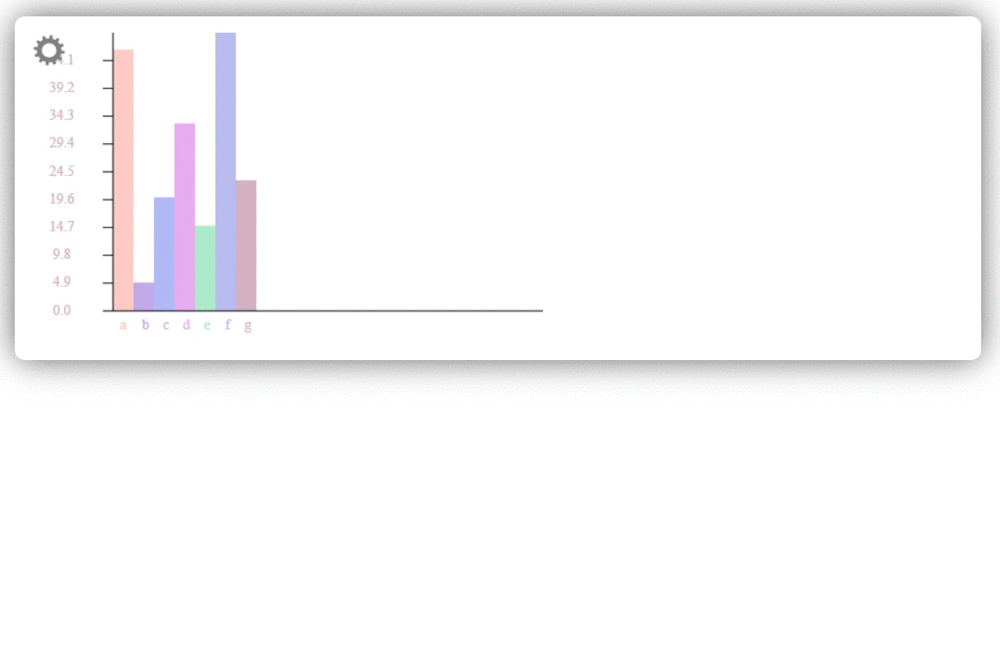
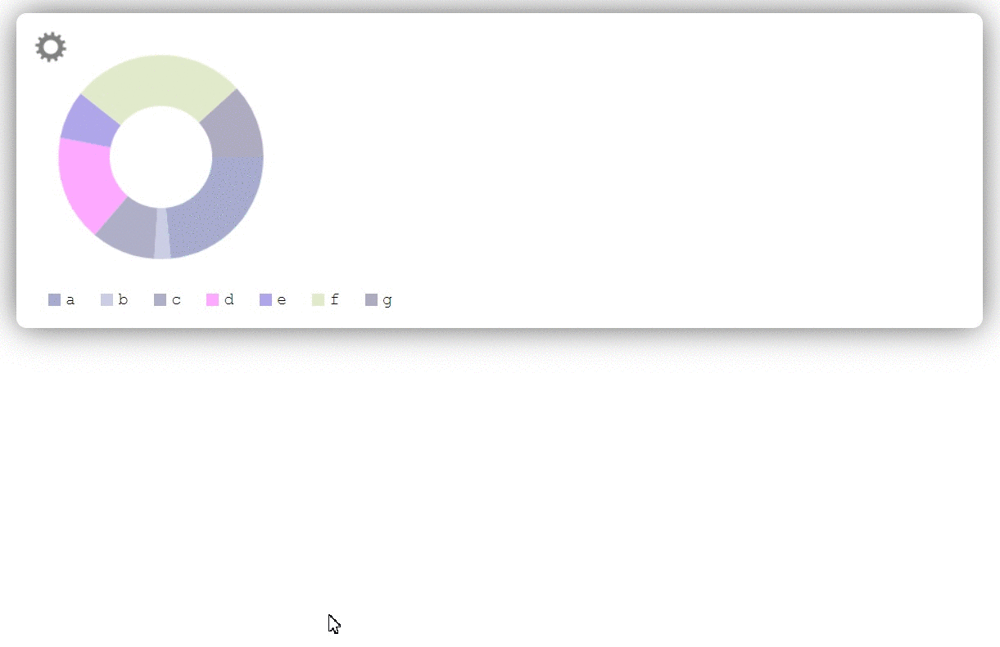
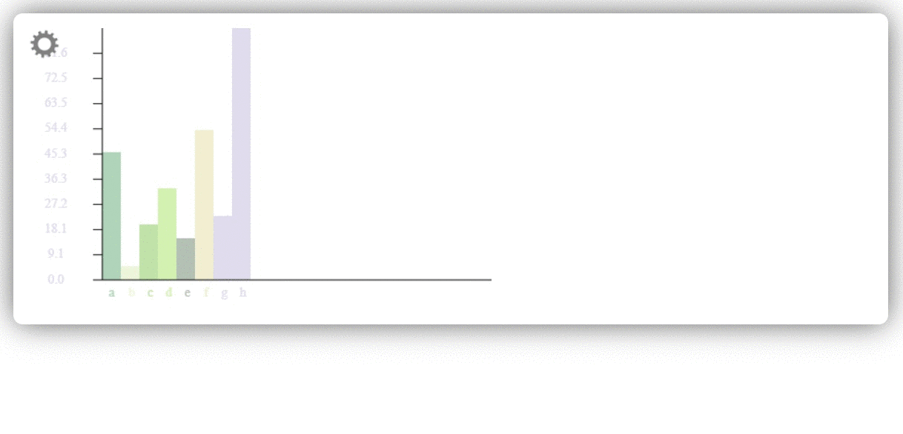

# plainChart

Небольшая библитека для построения столбчатых и круговых диаграмм
Посмотреть на GitHub-pages: https://morozov-work.github.io/plainChart/
  

## Описание

### Настройка внешнего вида диаграммы с помощью input range

  

### Изменение размера перетаскиванием и выделение значений

  

### Изменение типа диаграммы

  

### Изменение значений диаграммы

  

Библиотека написана на ванильном JS, собрана с помощью Webpack. Для стилей использован Sass и PostCSS.

Библиотека подключается в index.html и доступна через тэг script или как переменная через объект window (window.plainChart).
